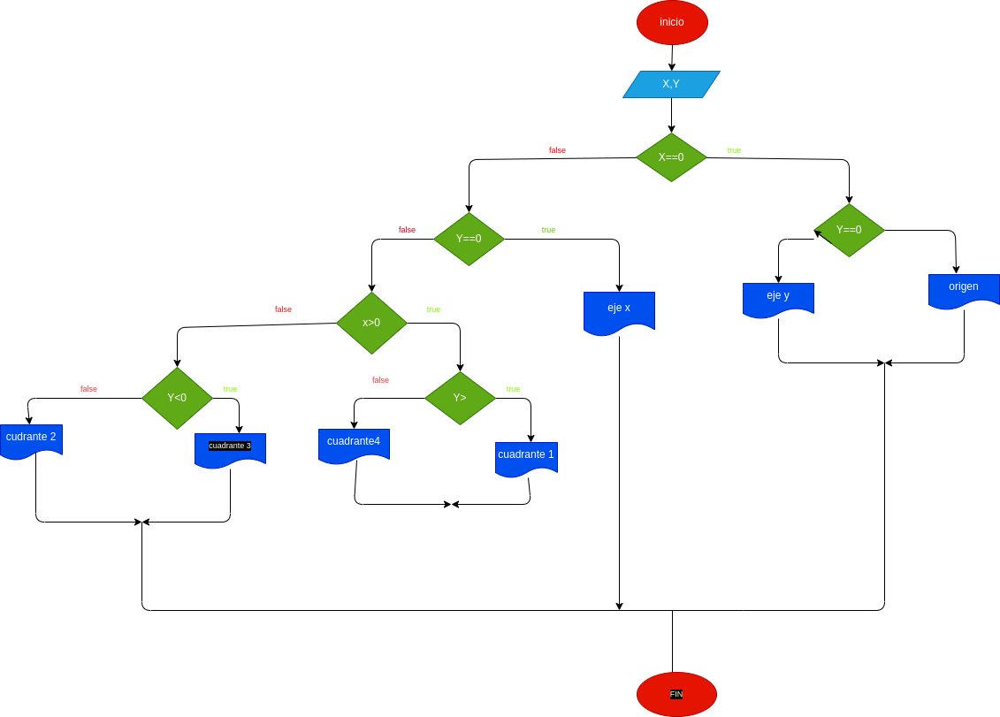

# Ejercicio NO.1

## Programa que lea las cordenadas carteciananas (X,Y) de un punto en el plano y calcule el cuadrantte esta un punto, de un plano carteciano

# entrada 
X = int(input("ingresa la cordenada X: "))
Y = int(input("ingresa la cordenanda Y:"))

# proceso 
if X == 0:
    if Y == 0:
        print("esta en el origen del plano carteciano(0,0) "
    else: 
        print("estas en el eje Y")   
elif Y == 0:
        print("estas en el eje X")
elif X > 0:
    if Y < 0:
    print("esstas en el cuadrante 1")
        else: 
        print("estas en el ccuadrante 4")
    elif Y > 0:
        print("estas en el cuadrante 3")
        else:
        print("estas en el cuadrante 2")

# DISEÑO

