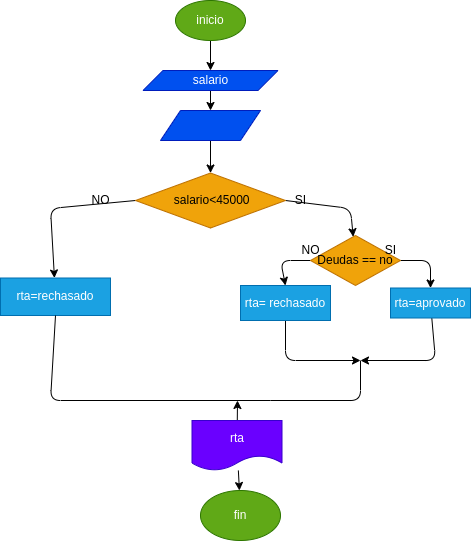

## Prestamo Bancario
Programa para si usted puede adquirir un prestamoen el banco segun su salario y si tienes Deudas anteriores
# Analisis

Variables de entrada

Salario =el dinerio necesario para adquirir el prestamo
Deudas  =saber si tiene deudas anteriores

variables de proceso 
salalrio >=numero ingresado 
deudad = si o no tienes deudas

variables de salida

Aceptado = su porestamo fue aceptado
Denegado = su prestamo fue denagado

Nos indicara si el prestamo fue aceptado o dengado su prestamo

# DISEÑO

# CONSTRUCCION